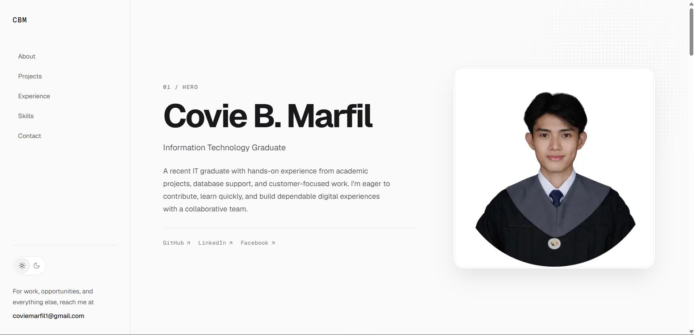

# Covie Marfil — Portfolio

A responsive, single-page developer portfolio for **Covie B. Marfil**. It highlights selected projects, practical experience, technical skills, social links, and a downloadable resume.



## Highlights

- Responsive layout with a desktop sidebar and mobile navigation
- Persistent light and dark themes
- Theme-aware portrait transition with reduced-motion support
- Project showcase for Portfolio Website, MOBEE, and Unimart
- Experience, education, skills, and direct contact sections
- Accessible semantic structure, keyboard focus states, and responsive media

## Built with

- [Next.js](https://nextjs.org/)
- [React](https://react.dev/)
- [TypeScript](https://www.typescriptlang.org/)
- [Tailwind CSS](https://tailwindcss.com/)
- [next-themes](https://github.com/pacocoursey/next-themes)
- [Lucide](https://lucide.dev/)

## Getting started

### Prerequisites

- Node.js 18.18 or later
- pnpm (recommended)

### Run locally

```bash
corepack enable
corepack pnpm install
corepack pnpm dev
```

Open [http://localhost:3000](http://localhost:3000) in your browser.

If pnpm prompts you to approve the `sharp` build script, run:

```bash
corepack pnpm approve-builds
```

Select `sharp`, then run the install command again.

### Production build

```bash
corepack pnpm build
corepack pnpm start
```

## Project structure

```text
app/          # Next.js App Router pages, layout, and global styles
components/   # Reusable portfolio sections and interface components
lib/          # Typed content for projects, experience, skills, and links
public/       # Portfolio images, videos, and resume PDF
```

## Contact

- GitHub: [@coviemarfil](https://github.com/coviemarfil)
- LinkedIn: [Covie Marfil](https://www.linkedin.com/in/covie-marfil-367484322/)
- Email: [coviemarfil1@gmail.com](mailto:coviemarfil1@gmail.com)

## Resume

The resume is available in the repository at [public/documents/Marfil_Covie_Resume.pdf](public/documents/Marfil_Covie_Resume.pdf).
